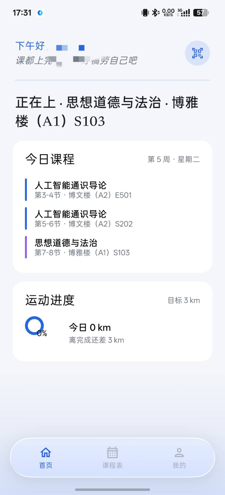
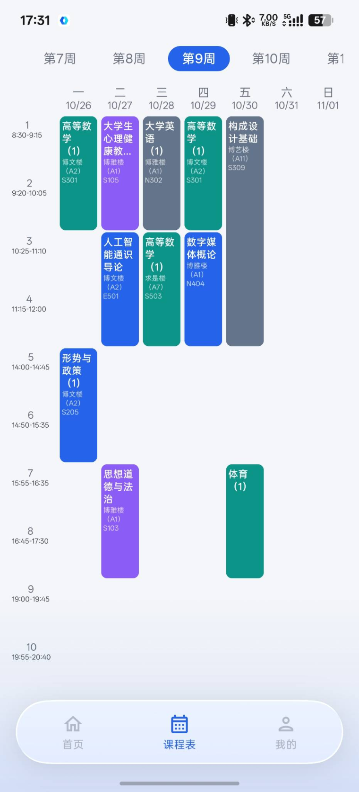
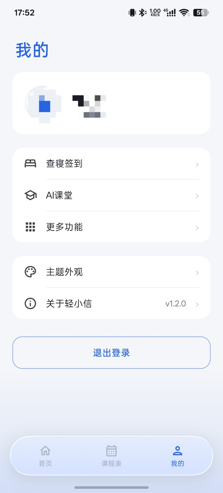
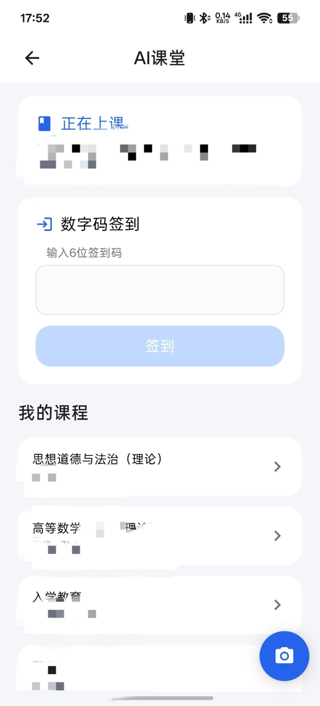

# 林小信

> **本仓库是 [轻小信 / Relianttt/lightxin](https://github.com/Relianttt/lightxin)（MIT）的个人定制 fork。**
> 上游的 `LICENSE`（Copyright (c) 2026 LightXin）原样保留，本 fork 的改动同样按 MIT 开源。
> 起因很朴素：安小信太卡了，于是在轻小信基础上改了整套界面与交互。

## 这个 fork 改了什么

- 界面从 Material3 全量换成 [Miuix](https://github.com/compose-miuix-ui/miuix)，配色改为白底 + 现代蓝，深色同步
- 首页悬浮液态玻璃底栏（[Kyant0 Backdrop](https://github.com/Kyant0/AndroidLiquidGlass)），设置页可实时调 模糊度 / 折射度 / 扭曲度 / 色散四根参数
- 主题外观页：主题模式（跟随系统 / 浅 / 深）、底栏材质、自定义主题色取色器、Material You (Monet) 开关
- 应用图标重绘 + 应用内动态开屏跟随主题色
- AI 课堂：会话缓存 + 首页预热，进入秒开、断网回退缓存
- 扫码入口提到首页；扫完点「确定」直接退出，不再停在"正在签到"的假死页
- 查寝页补齐：本月签到统计卡 + 签到月历 + 主题签到分组，接口按校方真实返回核对
- 节假日离返校独立成页（去登记 / 历史登记双标签），不再塞在查寝列表里
- 登录页「记住密码」：明文绝不落盘，密钥在 Android Keystore 里且不可导出
- 底栏新增「公告」页：校方门户资讯里的通知公告，分页列表 + 富文本详情
- 全站字体换成 [MiSans VF](https://hyperos.mi.com/font)（单个可变字体文件，`res/font/misans_w*.xml` 按字重锁 `wght` 轴），原 Newsreader 衬线大标题 / Outfit / Noto Serif SC 全部移除，详见 `MISANS-NOTICE.txt`
- 移除"检测更新"功能（GitHub Release 轮询、APK 下载与安装权限整体删除）
- 上游的内部设计文档目录 `codestable/` 不在本 fork 公开（其中含校方接口的鉴权细节）

## 截图

真机（ColorOS 17）实拍，个人信息已打码。

|  |  |  |  |
|:--:|:--:|:--:|:--:|
| 首页 | 课程表 | 我的 | AI 课堂 |

下方保留上游原 README 正文（**截图与安装两处已按本 fork 更新**：上游原版 7 张截图不再保留，安装不再指向上游）。

## 安装

> 本 fork 的安装包在 [Releases](https://github.com/linjianwuovo/linxiaoxin/releases/tag/v1.3.5)：
> `linxin-v1.3.5.apk`（debug 签名，minSdk 26 / Android 8.0+）。装过其它签名的版本需先卸载再装。

```bash
git clone https://github.com/linjianwuovo/linxiaoxin.git
cd linxiaoxin
./gradlew assembleDebug
```

需要 **Android Studio** 和 **JDK 17**。

> **从源码编译前请先放字体文件**：`misans_vf.ttf` 依 MiSans 协议第 3 条不进本仓库
> （公开仓放裸字体属于"单独分发字体副本"）。取官方包
> <https://hyperos.mi.com/font-download/MiSans_Global_ALL.zip>（397,995,650 字节；
> 注意路径是 `font-download` 连字符，不是页面上的 `/font/download`），解出内层
> `MiSans.zip` 中的 `MiSans/MiSans VF.ttf`（20,000,736 字节，sha256
> `5daf8d5447bfd423cfdec94a0e07c53b205892223ccc6ea21b7b8a37248b44d9`），重命名放到
> `app/src/main/res/font/misans_vf.ttf`；否则 `res/font/misans_w*.xml` 找不到引用目标、
> 编译会失败。协议原文与合规说明见 `MISANS-NOTICE.txt`。打进 APK 分发是协议明确允许的。

---

<!-- 以下为上游 轻小信 的原 README -->

# 轻小信

 -blue)

## 功能

覆盖安小信绝大部分常用功能：课程表、查寝签到、节假日登记、跑步、劳动教育、AI 课堂、考试成绩、素质学分。


## 截图

> 上游原版的截图（含 Material3 界面与"更多功能 / shortcut"页）不在本 fork 保留，
> 想看原版界面请去 [Relianttt/lightxin](https://github.com/Relianttt/lightxin)。本 fork 的界面见文首。


## 安装

> 见文首「安装」一节 —— 本 fork 的 APK 与源码编译方式都在那里，此处不再重复。


## 贡献

欢迎提交 Issue 和 Pull Request。


## 协议

本项目基于 [MIT License](LICENSE) 开源。


## 免责声明

本项目仅供学习交流使用。使用者须遵守相关法律法规，不得将本项目用于任何非法用途。因使用本项目产生的任何法律风险与责任，均由使用者自行承担。
